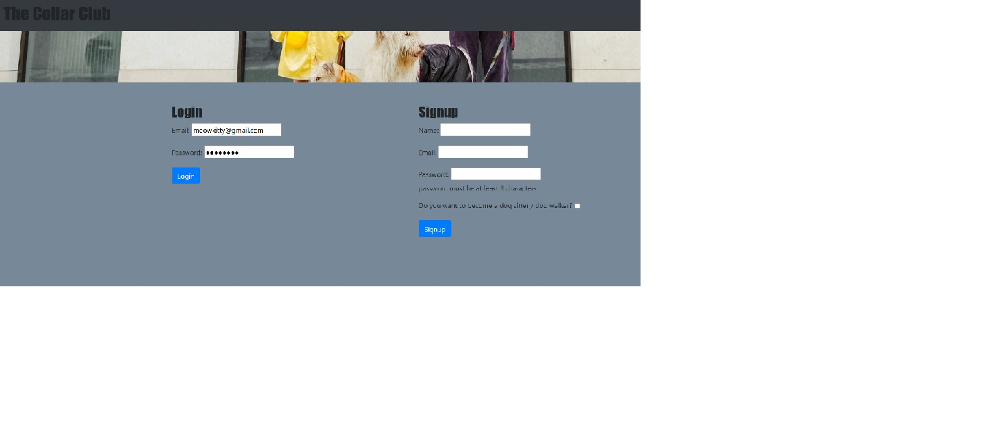

# Project-2 - The Collar Club
## Description

This program is used for Dog Walkers to create listings for their services and dog owners to post pictures to show off their dogs and get info on dog walkers so they can hire someone to care for their pets.  

- Used an MVC - model view controller format
- Used npm packages like handlebars, sequelize and SQL to manage the database and such
- Created a database to hold the provider and user information
- Created HTML and CSS to display the User Interface
- Created a controller with files to hold the routes to access the database
- Created a read.me

## Screenshots

### Screenshot of login screen

### Screenshot of provider input screen

### Screenshot of user search screen

## Link to Project

[https://github.com/HunterHarvell/the-collar-club]

## Credits

Programmers: 
-Eric Wall
-Mathew Williams
-Hunter Harvell
-Kim Van Wyk

Icon by <a href="https://freeicons.io/profile/5790">ColourCreatype</a> on <a href="https://freeicons.io">freeicons.io</a>
                                
## License

Please refer to the LICENSE in the repo.