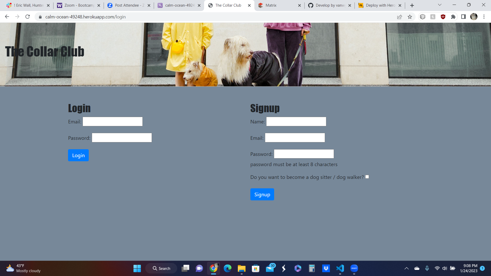
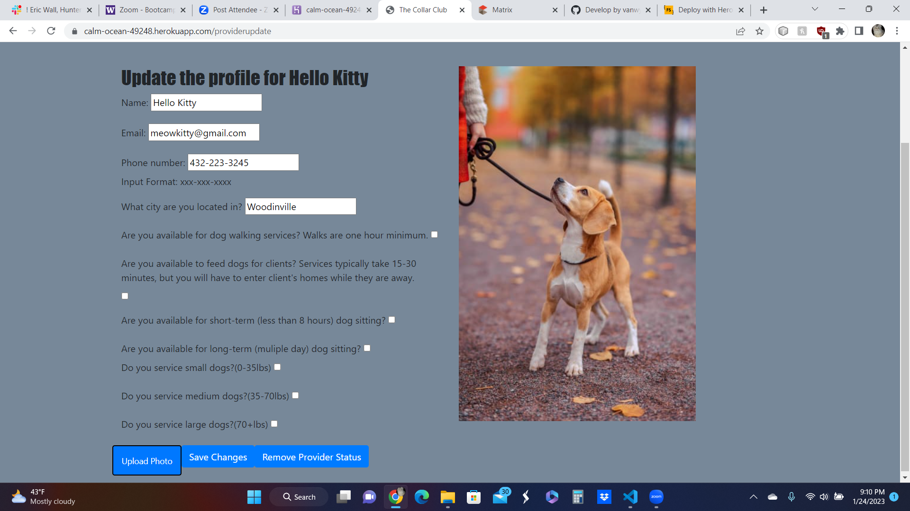
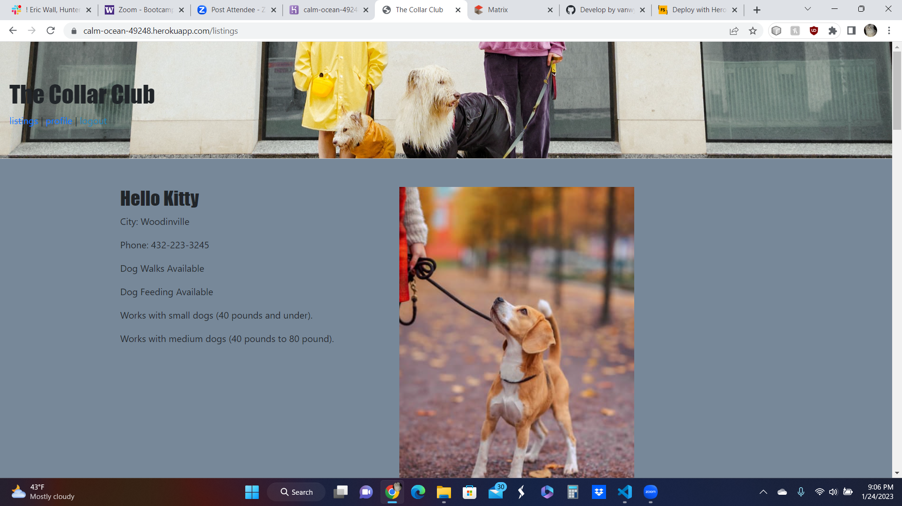

# Project-2 - The Collar Club
## Description

This program is used for Dog Walkers to create listings for their services and dog owners to post pictures to show off their dogs and get info on dog walkers so they can hire someone to care for their pets.  

- Used an MVC - model view controller format
- Used npm packages like handlebars, sequelize and SQL to manage the database and such
- Created a database to hold the provider and user information
- Created HTML and CSS to display the User Interface
- Created a controller with files to hold the routes to access the database
- Used Cloudinary to upload photos to user profile
- Created a read.me

## Screenshots

### Screenshot of login screen

### Screenshot of provider update screen

### Screenshot of top of listings screen scroll to see more

## Links to Project
### Git Hub
[https://github.com/walleric23/the-collar-club]

### Heroku
[https://calm-ocean-49248.herokuapp.com/]

## Credits

Programmers: 
-Eric Wall
-Mathew Williams
-Hunter Harvell
-Kim Van Wyk

Cloudinary  
UW Bootcamp
## License

Please refer to the LICENSE in the repo.